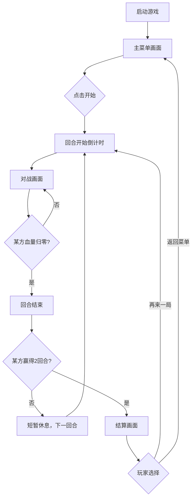

# 像素风机甲对战 - 产品需求文档

## 1. 产品概述

一款复古像素风格的双人本地对战机甲格斗游戏。玩家各自操控一台机甲，通过移动、冲刺、轻重攻击、技能释放和防御等操作，将对方机甲的生命值削减至零以获得胜利。游戏采用三局两胜制，强调打击感和节奏感，视觉上致敬经典街机格斗与 16-bit 机甲游戏。

- 目标用户：喜欢格斗游戏、机甲题材和复古像素风格的玩家
- 核心价值：打击感强烈的双人对战体验，易上手但有博弈深度

## 2. 核心功能

### 2.1 功能模块

1. **主菜单页面**：游戏标题、像素机甲展示、操作说明、开始按钮
2. **对战页面**：核心游戏画布，包含两个机甲、HUD、特效动画、暂停功能
3. **结算页面**：胜负结果展示、重新开始按钮

### 2.2 页面详情

| 页面名称 | 模块名称 | 功能描述 |
|---------|---------|---------|
| 主菜单 | 标题展示 | 像素风格标题 "MECHA CLASH"，霓虹发光，上下浮动 |
| 主菜单 | 机甲展示 | 左右各展示一台机甲，呼吸动画，喷射粒子 |
| 主菜单 | 操作说明 | 左右分列展示 P1/P2 完整键位表 |
| 主菜单 | 开始按钮 | 像素按钮，hover 闪烁，点击后进入对战 |
| 对战页面 | 游戏画布 | Canvas 960x640，CRT 扫描线覆盖，多层视差背景 |
| 对战页面 | 机甲角色 | P1 赤红机甲 / P2 苍蓝机甲，含 6 种动画状态 |
| 对战页面 | HUD 界面 | 双方头像+血条+能量条+连击数，中央计时器+回合指示灯 |
| 对战页面 | 特效系统 | 攻击刀光、命中火花、技能全屏闪、屏幕震动、受击停顿、冲刺残影、CRT 扫描线 |
| 对战页面 | 暂停遮罩 | 半透明遮罩 + 暂停菜单 |
| 结算页面 | 胜负展示 | 胜利方机甲特写 + 粒子庆祝，像素大字动画 |
| 结算页面 | 操作按钮 | 再来一局、返回主菜单 |

## 3. 核心流程

## 4. 游戏玩法设计

### 4.1 操作方式

| 操作 | 玩家1（赤红机甲） | 玩家2（苍蓝机甲） |
|------|------------------|------------------|
| 上移 | W | 方向键 ↑ |
| 下移 | S | 方向键 ↓ |
| 左移 | A | 方向键 ← |
| 右移 | D | 方向键 → |
| 轻攻击 | J | 小键盘 1 |
| 重攻击 | K | 小键盘 2 |
| 防御 | L | 小键盘 3 |
| 冲刺 | 双击 A/D | 双击 ←/→ |

### 4.2 战斗机制

**基础属性**：
- 生命值（HP）：100，归零则该回合失败
- 能量值（EP）：初始 0，上限 100
- 能量获取：命中敌人 +15 EP，受到伤害 +10 EP，随时间缓慢恢复 +3/秒

**攻击系统**：
- 轻攻击：8 伤害，出手快（前摇 0.1s），冷却 0.4s，范围 40px
- 重攻击：15 伤害，出手慢（前摇 0.3s），冷却 0.8s，范围 50px，命中附带短暂击退
- 技能攻击（消耗 40 EP）：20 伤害，前摇 0.2s，冷却 2s，范围 60px，全屏闪光 + 强击退

**防御系统**：
- 按住防御键：减免 60% 伤害，移动速度降低 50%
- 防御中无法攻击，松开即恢复

**冲刺系统**：
- 双击方向键触发短距离冲刺（200px 距离，持续 0.15s）
- 冲刺期间无敌帧，冷却 1.5s
- 冲刺留下像素残影

**打击感设计**：
- 命中时画面短暂停顿（hitstop 4-6 帧）
- 伤害数字从命中点飘出
- 屏幕震动幅度与伤害成正比
- 受击方短暂闪烁红色

**碰撞系统**：
- 双方机甲有碰撞体积，不可重叠
- 推开时双方各后退一半距离

### 4.3 回合制

- 三局两胜制（Best of 3）
- 每回合开始时 3 秒倒计时
- 回合间有 2 秒休息间隔，重置 HP 和位置
- 先赢 2 回合者获胜

### 4.4 平衡性

- 双方机甲属性完全对称，仅颜色差异
- 轻攻击风险低收益低，重攻击风险高收益高
- 冲刺有冷却限制，防止滥用无敌帧
- 能量靠攻击获取，鼓励主动进攻

## 5. 视觉风格设计

### 5.1 设计主题

**核心概念**：赛博工业 + 16-bit 机甲格斗

- 深色工业废墟场景，巨大的机械结构剪影
- 霓虹灯管点缀，像素化的发光效果
- CRT 显示器扫描线纹理覆盖全屏
- 高对比度，强光影

### 5.2 配色方案

| 用途 | 颜色 | 色值 |
|------|------|------|
| 背景深色 | 深灰黑 | #0d0d1a |
| 场景中层 | 暗紫灰 | #1a1a2e |
| 场景前景 | 暗灰蓝 | #16213e |
| P1 主色 | 霓虹赤红 | #ff3333 |
| P1 暗色 | 深红 | #991111 |
| P2 主色 | 霓虹苍蓝 | #3399ff |
| P2 暗色 | 深蓝 | #113399 |
| 能量条 | 荧光绿 | #33ff66 |
| 高亮文字 | 金色 | #ffcc33 |
| 伤害数字 | 橙黄 | #ff9933 |
| 地面网格 | 暗蓝灰 | #1e2d4a |

### 5.3 机甲设计（程序化像素绘制）

**赤红机甲（P1）**：
- 配色：红/深红/橙红
- 造型：棱角分明，锐利线条，V 形头部天线
- 体型：略宽肩，重型战斗风格
- 武器：右臂能量拳套

**苍蓝机甲（P2）**：
- 配色：蓝/深蓝/青蓝
- 造型：流线型，弧形装甲，弯刀形头部天线
- 体型：略修长，高机动风格
- 武器：右臂光束刃

**动画状态（各 4 帧）**：
- idle：呼吸起伏 + 细微粒子喷射
- walk：双腿交替 + 手臂摆动
- light_attack：快速出拳 + 收回
- heavy_attack：蓄力后重击
- skill：特殊姿势 + 能量爆发
- block：防御姿态，手臂交叉
- hurt：受击后仰
- dash：冲刺姿态

### 5.4 场景设计

**背景层（3 层视差）**：
- 远层：城市天际线剪影，缓慢移动
- 中层：巨型工业管道和齿轮结构，中速移动
- 近层：像素网格地面 + 战损痕迹

**特效清单**：
- 攻击刀光（弧形像素轨迹）
- 命中火花（方块粒子爆散）
- 技能特效（全屏闪光 + 能量柱）
- 冲刺残影（半透明机甲轮廓）
- 受击屏幕震动（随机偏移）
- 伤害数字（像素字体飘出）
- CRT 扫描线覆盖
- 能量粒子飘浮

### 5.5 页面设计概览

| 页面 | 模块 | 视觉设计 |
|------|------|---------|
| 主菜单 | 背景 | 暗色工业废墟 + 缓慢飘浮的火花粒子 + 网格线 |
| 主菜单 | 标题 | 像素大字 "MECHA CLASH"，霓虹灯管发光，上下浮动 ±8px |
| 主菜单 | 机甲展示 | 左右各站一台机甲，播放 idle 动画，脚下有光晕 |
| 主菜单 | 键位表 | 像素风格框体，左右分列，键位用像素框标出 |
| 主菜单 | 开始按钮 | 像素边框按钮，hover 发光脉冲，文字 "PRESS START" |
| 对战 | 场景 | 3 层视差背景 + 网格地面 |
| 对战 | HUD | 顶部横条，双方头像+血条+能量条+连击，中央计时器+回合点 |
| 对战 | 特效 | 上述所有特效，按事件触发 |
| 结算 | 遮罩 | 半透明黑底，胜者机甲居中放大，粒子庆祝 |
| 结算 | 文字 | "PLAYER X WINS!" 像素大字逐字弹出 |

### 5.6 响应式设计

- 桌面优先，Canvas 固定 960x640
- 小屏幕等比缩放适配

## 6. 素材方案

全部通过 Canvas 2D 程序化绘制，零外部图片依赖：

- 机甲精灵：fillRect 逐像素块绘制，4px 像素块单位
- 场景：渐变 + 矩形 + 线条组合
- 粒子：fillRect 小方块
- 文字：Google Fonts "Press Start 2P" 加载
- UI 组件：Tailwind 样式 + React 组件