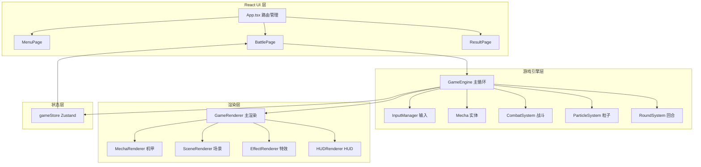
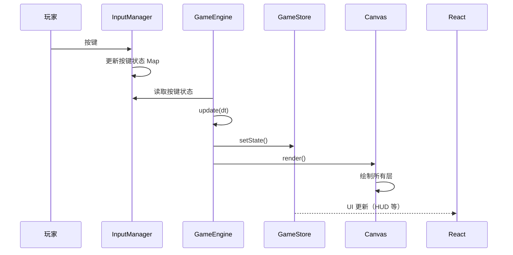

# 像素风机甲对战 - 技术架构文档

## 1. 架构设计



## 2. 技术选型

| 技术层 | 选型 | 说明 |
|--------|------|------|
| 前端框架 | React 18 + TypeScript | 页面路由和 UI 组件 |
| 构建工具 | Vite | 开发服务与构建 |
| 样式 | Tailwind CSS 3 | UI 组件样式 |
| 状态管理 | Zustand | 游戏全局状态 |
| 游戏渲染 | HTML5 Canvas 2D | 核心游戏画面渲染 |
| 字体 | Google Fonts (Press Start 2P) | 像素风格字体 |

## 3. 项目结构

```
src/
├── main.tsx
├── App.tsx
├── index.css
├── pages/
│   ├── MenuPage.tsx
│   ├── BattlePage.tsx
│   └── ResultPage.tsx
├── game/
│   ├── engine.ts            # 游戏主循环
│   ├── constants.ts         # 所有常量
│   ├── types.ts             # 类型定义
│   ├── input.ts             # 键盘输入管理
│   ├── entities/
│   │   └── mecha.ts         # 机甲实体（状态+逻辑）
│   ├── systems/
│   │   ├── combat.ts        # 战斗/伤害计算
│   │   ├── particles.ts     # 粒子系统
│   │   └── round.ts         # 回合管理
│   └── renderer/
│       ├── index.ts         # 主渲染器入口
│       ├── mecha.ts         # 机甲像素精灵绘制
│       ├── scene.ts         # 场景背景绘制
│       ├── effects.ts       # 特效（刀光/闪光/震动）
│       └── hud.ts           # HUD 界面绘制
├── components/
│   └── GameCanvas.tsx        # Canvas 包装组件
├── stores/
│   └── gameStore.ts          # Zustand store
└── utils/
    └── pixel.ts              # 像素绘制工具函数
```

## 4. 核心类型定义

```typescript
type GamePhase = 'menu' | 'countdown' | 'battle' | 'round_end' | 'result';
type AnimationState = 'idle' | 'walk' | 'light_attack' | 'heavy_attack' | 'skill' | 'block' | 'hurt' | 'dash';
type Facing = 'left' | 'right';

interface Vec2 { x: number; y: number; }

interface MechaState {
  id: 'p1' | 'p2';
  pos: Vec2;
  vel: Vec2;
  hp: number;
  maxHp: number;
  ep: number;
  maxEp: number;
  facing: Facing;
  anim: AnimationState;
  animFrame: number;
  animTimer: number;
  isBlocking: boolean;
  attackTimer: number;      // 攻击剩余时间
  lightCooldown: number;
  heavyCooldown: number;
  skillCooldown: number;
  dashCooldown: number;
  isDashing: boolean;
  dashTimer: number;
  invincible: boolean;
  hitstopTimer: number;     // 受击停顿
  hurtFlash: boolean;       // 受击闪白
  color: 'red' | 'blue';
  combo: number;
  roundsWon: number;
}

interface Particle {
  x: number; y: number;
  vx: number; vy: number;
  life: number; maxLife: number;
  color: string;
  size: number;
  type: 'spark' | 'smoke' | 'energy';
}

interface DamageNumber {
  x: number; y: number;
  value: number;
  life: number;
  vy: number;
}

interface GameState {
  phase: GamePhase;
  p1: MechaState;
  p2: MechaState;
  particles: Particle[];
  damageNumbers: DamageNumber[];
  screenShake: { intensity: number; timer: number };
  screenFlash: { alpha: number; timer: number; color: string };
  timer: number;
  countdown: number;
  roundWinner: string | null;
  gameWinner: string | null;
  paused: boolean;
}
```

## 5. 游戏循环

```
requestAnimationFrame 驱动 (目标 60 FPS):

1. calculateDeltaTime()  - 计算帧间隔 dt
2. processInput()         - 读取按键状态
3. updateGame(dt):
   a. 更新倒计时/计时器
   b. 处理 hitstop（暂停更新）
   c. 更新机甲：位置、动画、冷却、冲刺
   d. 处理攻击：命中检测、伤害、击退、能量
   e. 处理防御：减伤
   f. 更新粒子系统
   g. 更新伤害数字
   h. 更新屏幕震动/闪光
   i. 检测回合结束
4. render():
   a. 清屏
   b. 绘制场景（3层视差）
   c. 绘制粒子（底层）
   d. 绘制机甲（按 Y 坐标排序）
   e. 绘制粒子（顶层）
   f. 绘制伤害数字
   g. 绘制 HUD
   h. 绘制屏幕震动偏移
   i. 绘制屏幕闪光
   j. 绘制 CRT 扫描线
```

## 6. 数据流



## 7. 机甲像素绘制方案

每个机甲约 48x64 像素（12x16 像素块，每块 4px），程序化绘制：

```
头部结构（4x4 块）：
  ■□■■
  ■■■■
  □■■□
  ■■■■

躯干（6x6 块）：
  □■■■■□
  ■■■■■■
  ■■■■■■
  ■■■■■■
  ■■■■■■
  □■■■■□

手臂（2x5 块，每侧）：
  ■■
  ■■
  ■■
  ■■
  ■■

腿部（3x4 块，每条）：
  ■■■
  ■■■
  ■■■
  ■■■
```

动画通过偏移关键像素块位置实现，每帧略微调整关节角度和位置。每个动画 4 帧，帧间隔 100-150ms。

## 8. 场景渲染层级

| 层级 | 内容 | 绘制方式 |
|------|------|---------|
| 0 | 天空渐变背景 | 径向渐变 |
| 1 | 远层城市剪影 | 矩形组合 + 视差 |
| 2 | 中层工业管道 | 矩形/线条 + 视差 |
| 3 | 背景粒子 | 飘浮像素点 |
| 4 | 机甲角色 | 像素精灵绘制 |
| 5 | 刀光特效 | 弧形轨迹 |
| 6 | 命中粒子 | 方块爆散 |
| 7 | 伤害数字 | 像素文字 |
| 8 | 屏幕闪光 | 全屏半透明 |
| 9 | CRT 扫描线 | 横线纹理 |
| 10 | HUD | 血条/能量条/计时 |